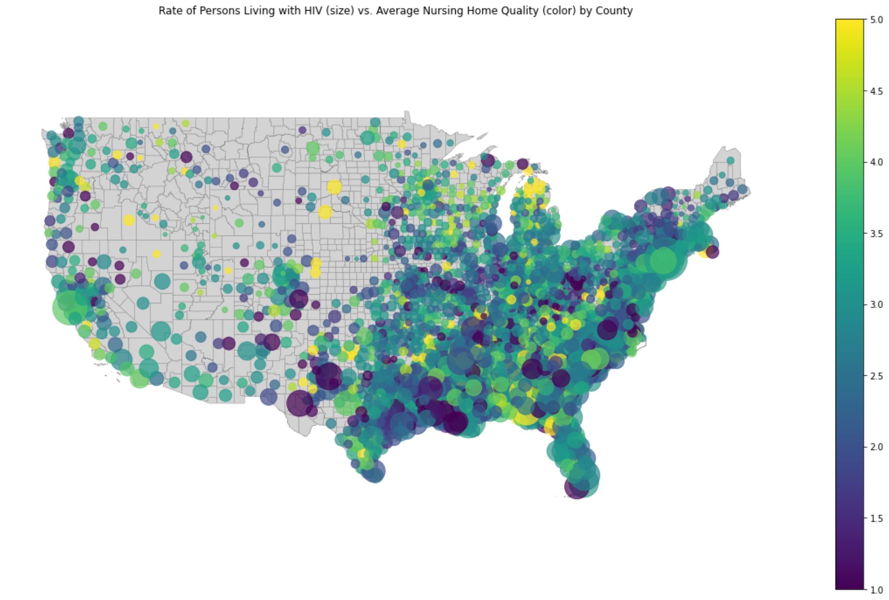
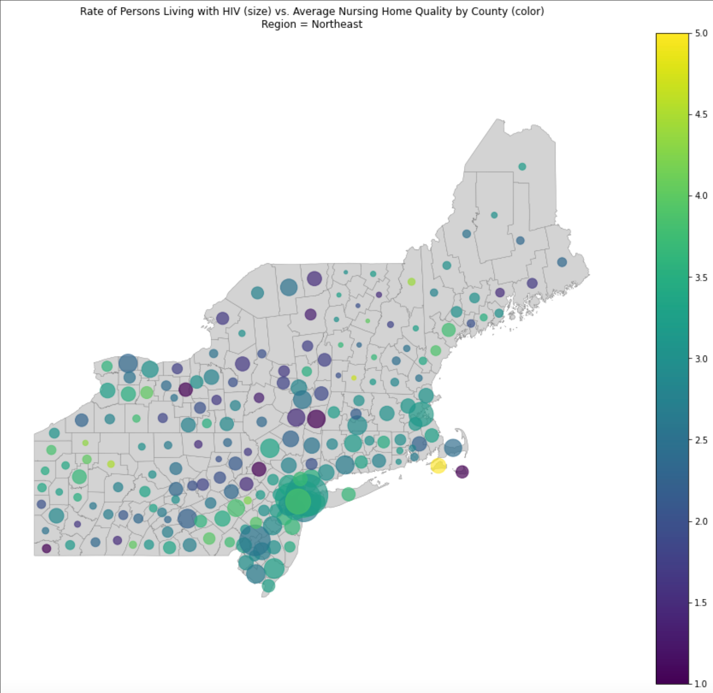
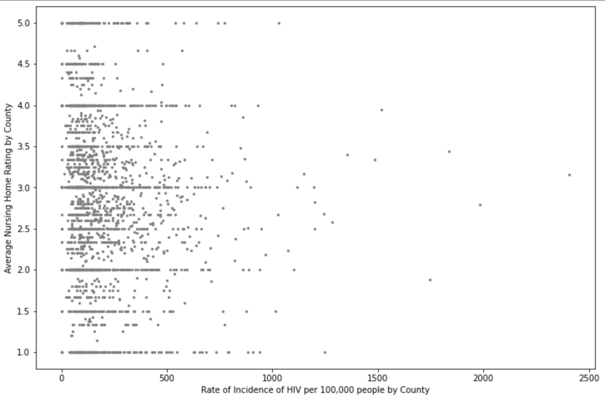
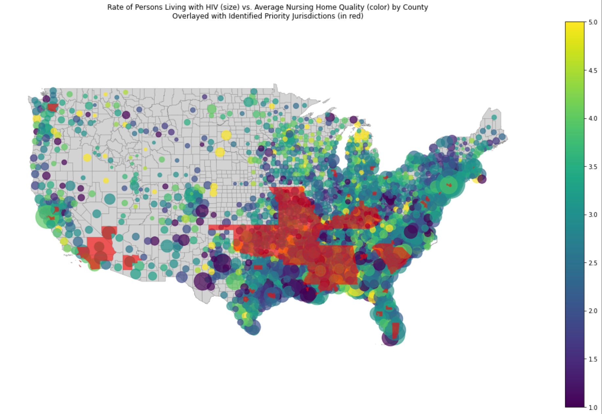
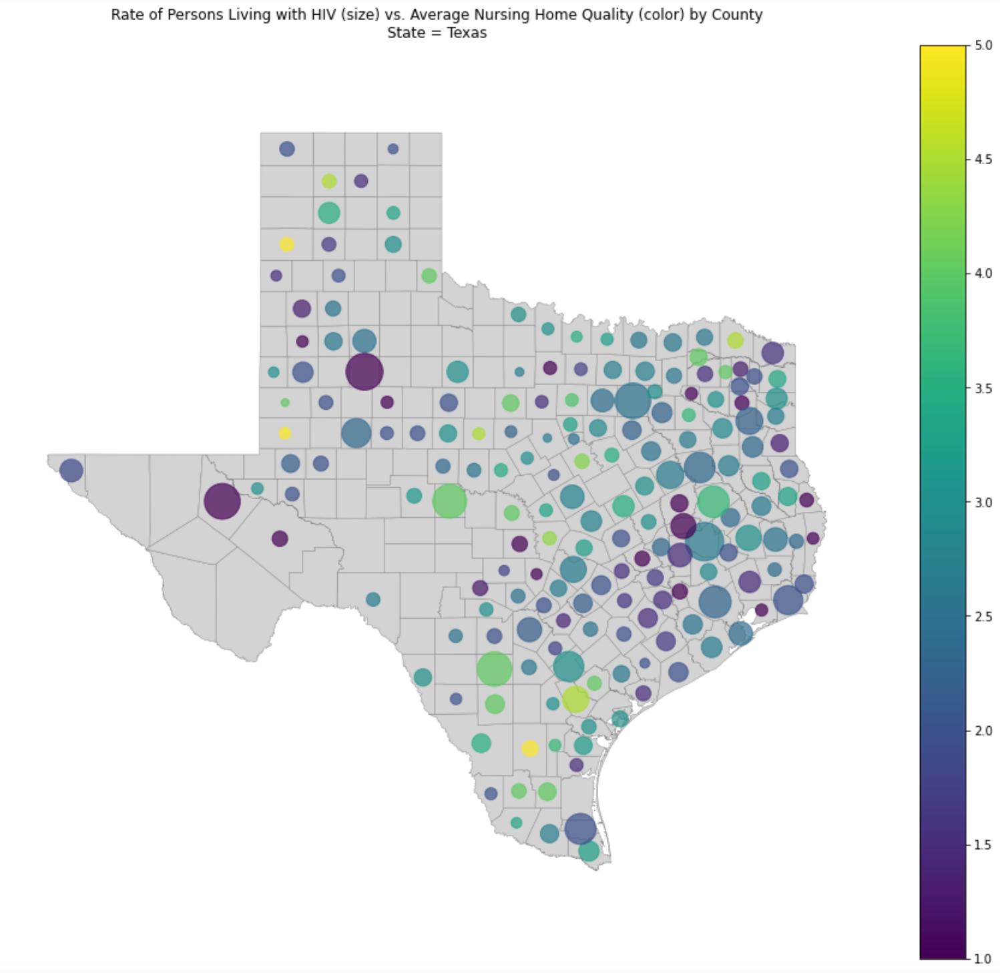
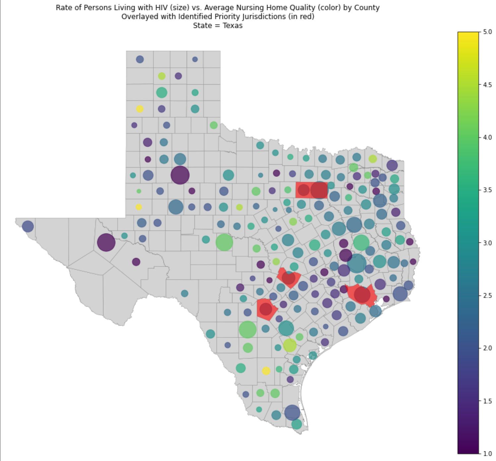
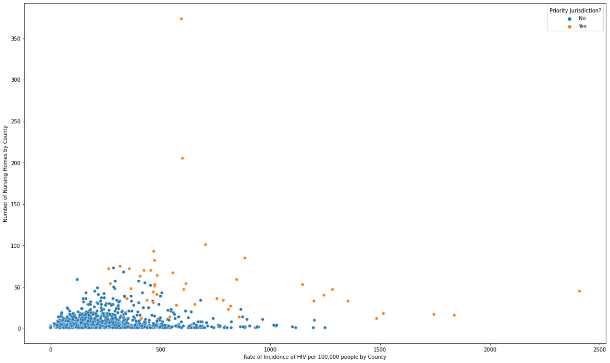
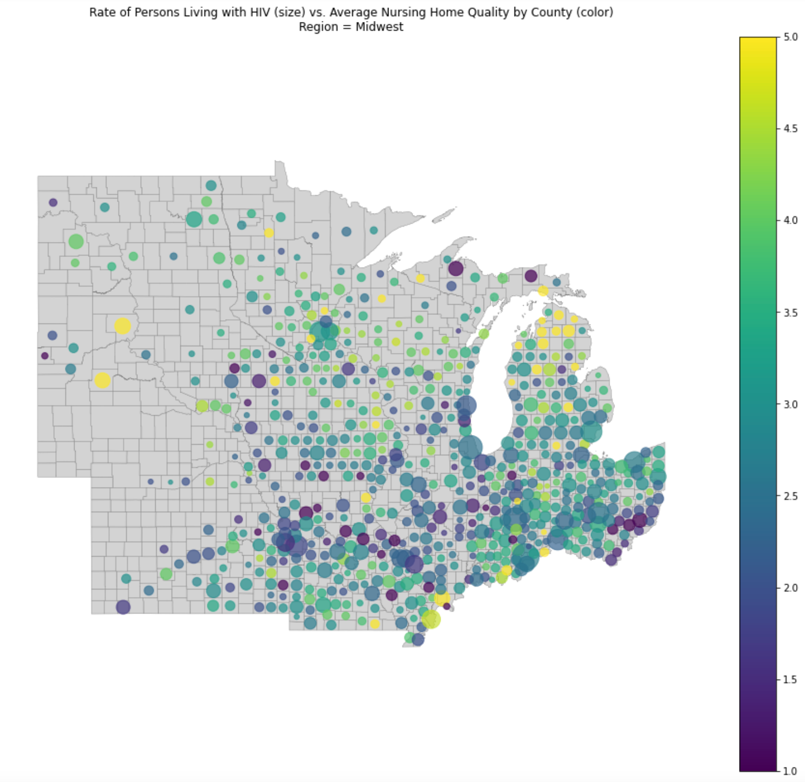
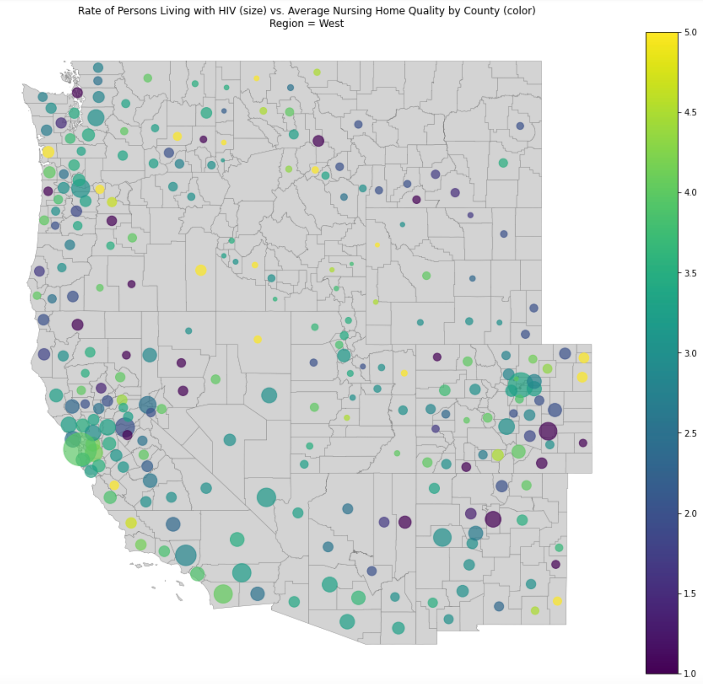
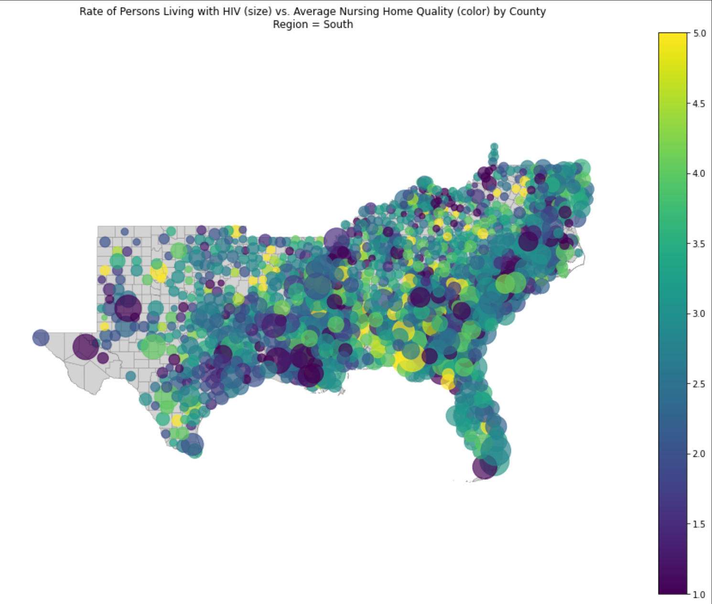

# HIV-fall22
Data visualization project comparing rates of people living with HIV to instances of nursing homes
Authors:
Nick Barnes 
Paige Norris

# HIV / Medicare / Medicaid / Nursing Homes

### Why do we care?
HIV and aids is a significant public health issue that has resulted in the deaths of over 38 million people. Medicaid is the only public insurance that pays for nursing home care. A significant portion of people living with HIV (PLWH) have Medicaid, many are also dually eligible for Medicare. Having Medicaid or Medicare means access to Part D prescription drug coverage which is mandated to cover HIV medications (they are one of the 6 protected classes of drugs). Nursing homes however do not keep these drugs on formulary because they are relatively rare and is potentially contributing to issues with antiretroviral therapy (ART) adherence in this setting. There exists publicly available data provided by Medicare.gov that ranks nursing homes on a star rating from 1 to 5, with 1 indicating the worst care and 5 indicating the best care. 

Research has shown that people with HIV tend to go to lower quality nursing homes, not because that is their preference but because it is where they live. Most people chose a nursing home based on proximity to where they live or where family lives. Because older PLWH often have a family of choice as their primary support network, it is unlikely they will relocate for elder care. EHE allocates money to high AIDS areas (ex. Boston SMA), but how much of that money is allocated to elder care is unknown because it is left up to the jurisdiction. If we can show need, this may be one way to encourage resource allocation to elder care. 

The overall goal of this project was to determine how best to fund the National Ending the HIV Epidemic. The future of this map includes updates on drug coverage for HIV medications in nursing homes. Our map will arguably provide a visual of how grossly underserved the areas with the highest HIV burden are as relates to elder care, particularly nursing homes. This will give us an indication of which nursing homes should expect to get the most PLWH and where resources should be allocated.

___
### Questions to answer for our stakeholder
Our stakeholder is interested in this topic from the viewpoint of an epidemiologist. How can we most efficiently provide funding to supposrt the ending of the HIV epidemic? To begin to answer this we decided to focus on the following questions: 

1. Compare CMS nursing homes on a map to show nursing home quality at various levels of granularity. 
2. Overlay AIDSVu data to see concentration of HIV in the area of each NH.
3. Identify which areas are National Ending the HIV Epidemic area for funding.

___
### Major Results
The results are divided in to the three questions posed above.  
1. Compare CMS nursing homes on a map to show nursing home quality at various levels.

In the map below, we begin to explore not only the average quality of nursing homes by county, but also the corresponding rates of people living with HIV by county. From this map, we can start to develop a broad sense of which counties might be areas of concern. However, it’s difficult to make distinctions and get a clear idea of what’s going on. This is partially due to the nature of the larger number of smaller counties that make up the eastern part of the US.



We can more clearly make distinctions if we break up the map into smaller groupings.



Visually, this zooming in allows us to better assess and visually evaluate areas of concern. Quantitatively, we can use scatterplots to represent and assess this data as well. This scatterplot (from our exploratory data analysis) doesn't show a very clear relationship between nursing home quality and rates of HIV, however it can help us to better determine which data points might be areas of concern-- those with high rates of HIV (further right in the plot) and lower average nursing home quality (lower in the plot). 



___

2. Overlay AIDSVu data to see concentration of HIV in the area of each NH.

We can then further examine the relationship between HIV and nursing home ratings by comparing the nursing homes  and AIDSVu data. In this figure, we overlay the priority jurisdictions in red (leading us into question 3) to get a better understanding of which areas have already been identified for funding and which areas might be areas of concern for directing funding in the future. 



___

3. Identify which areas are potential National Ending the HIV Epidemic area for funding.
To identify further counties of potential funding for nursing homes, we can zoom focus on one state to identify those with high HIV rates and poor nursing home ratings. 


We can overlay the priority jurisdiction data to see those that already are recieving funding. 


We can better understand the relationship here with a scatterplot. While we visualized the relationship between rates of PLWH and Nursing Home quality previously, we can now include the priority jurisdiction data in order to understand where those priority jurisdictions are relative to the rest of the data:


Here, those data points corresponding to counties which have been identified as priority jurisdictions are displayed in orange, while non-priority counties are displayed in blue. 

In general, priority jurisdiction counties appear to be those with higher rates of people living with HIV (expected). It also seems as though, in general, priority jurisdictions are counties with average nursing home qualities between 2-4 (mid-range). 

- It would be interesting in further exploring this data to include data from previous years to see whether there has been change over time (ie. whether these counties had lower average NH scores before they recieved funding/whether they have improved at all over time since receiving funding). 
- It is also important to note that our data doesn't take into account population size, which may be another key factor in deciding which counties are identified as priority jurisdictions. It would be interesting to revisit this analysis with population data (and data over time) included. 

This second scatterplot visualizes the relationship between rates of people living with HIV and the number of nursing homes in each county:



In general, we see that priority jurisdictions are again those with high rates of people living with HIV. In this figure, it looks as though priority jurisdictions are also generally those with more nursing homes. This is likely a result of those counties being the counties with the largest populations (and thus the counties able to best serve the most people with extra funding). However, we would again need to revisit this analysis with county population data included in order to better deteremine a conclusion here, and to better make further predictions. 

___
### Reproducibility
All data used within this repository is publicly available to download and use. 

Additionally, if there is interest in other specific cases of the following links can be used to access the overall data directory of all the datasets to explore other groupings. 

- Highest level: star rating https://www.medicare.gov/care-compare/?providerType=NursingHome&redirect=true  
- POS files: nursing hours per patient day, complaints https://data.cms.gov/provider-characteristics/hospitals-and-other-facilities/provider-of-servicesfile-hospital-non-hospital-facilities
- AIDSVu data for concentration of HIV. https://map.aidsvu.org/map
- EHE Priority Jurisdictions: list available on the EHE website https://www.hiv.gov/federal-response/ending-the-hiv-epidemic/jurisdictions/phase-one
___
Information on folders in this repo
- Geodata: contains .shp files pulled from census.gov
- Hivdata : contains publicly available healthcare and nursing home data files 
- Checkin data: .rm prepared for a course assignment
- Feasibility: .rm prepared for a course assignment
- Figs: images of created maps
- Src: code for reproducing results

___
### Future work
- Implement interactivity for all maps.
- Include data from previous years in order to assess change over time. 
- Increase granularity further to idividual zipcodes for higher precision.
- Scale by population size by county.

<!-- ___
___
___
## Figures: (to be used in presentation of results)


Recreate this figure with:

```
make us_map1
```

___


Recreate this figure with:

```
make northeast_map
```

___



Recreate this figure with:

```
make midwest_map
```

___



Recreate this figure with:

```
make west_map
```

___



Recreate this figure with:

```
make south_map
```

___


Recreate this figure with:

```
make us_map2
```

___


Recreate this figure with:

```
make texas_map1
```

___


Recreate this figure with:

```
make texas_map2
```
___


Recreate this figure with:

```
make scatter3
```

___


Recreate this figure with:

```
make scatter4
```


___
 -->
